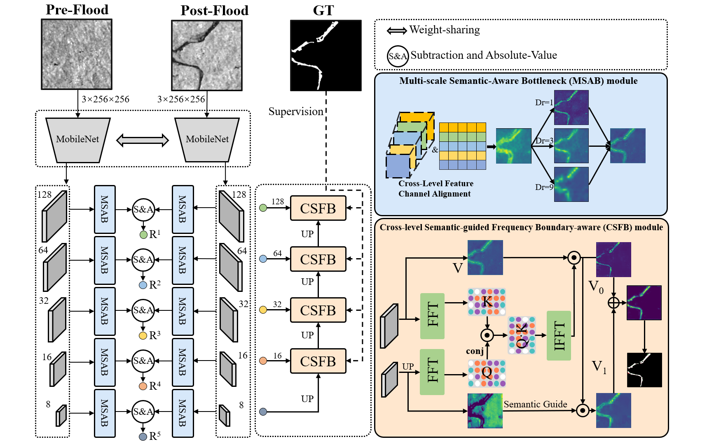
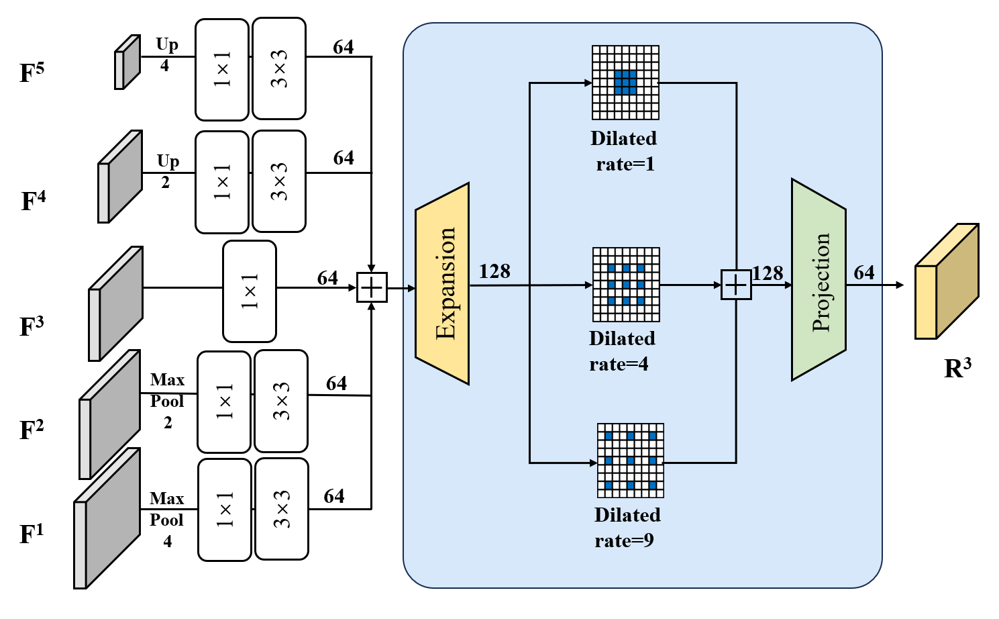
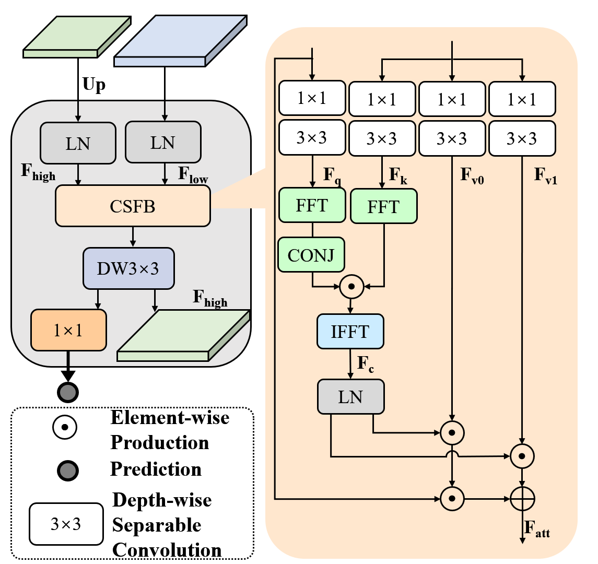
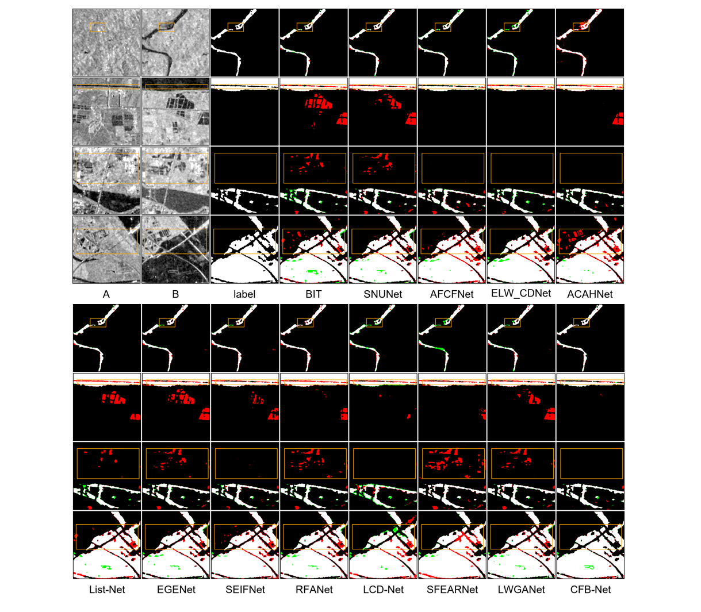
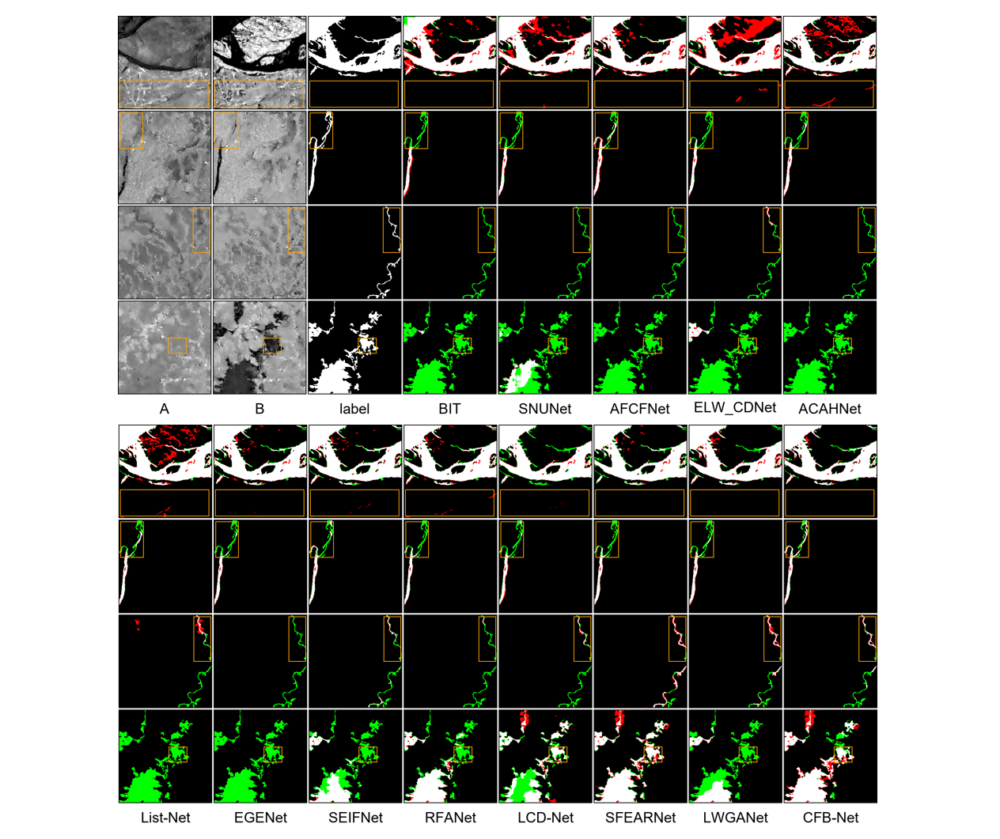
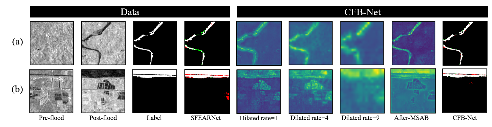
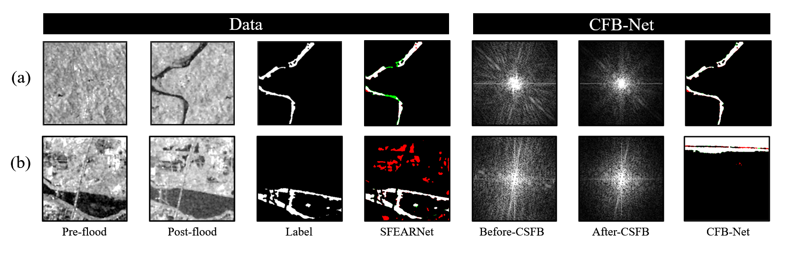
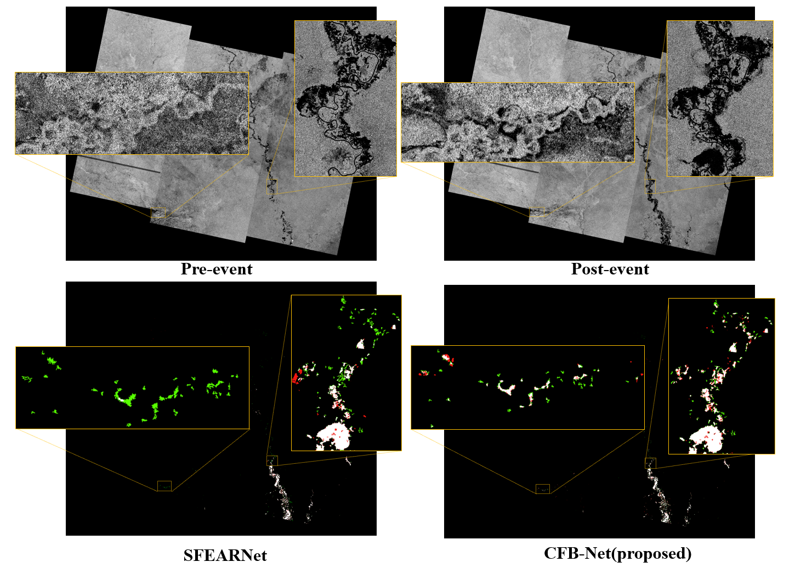
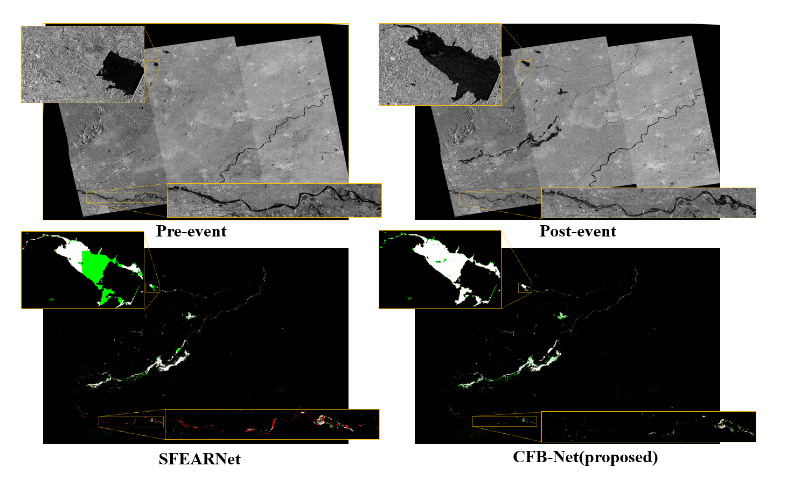

# <p align="center">CFB-Net: Cross-Level Frequency-Domain Boundary-Aware Lightweight Network for SAR Flood Detection</p>

> **Authors:**
> Xingye Yang, Tianyu Wei, Lyuzhou Gao, Wenchao Liu, Jue Wang (Corresponding Author), and Liang Chen
>
> **Code Repository:** [https://github.com/yeying0212/CFB_Net](https://github.com/yeying0212/CFB_Net)

This repository contains the official PyTorch implementation of **CFB-Net**, a lightweight cross-level frequency-domain boundary-aware network for bi-temporal SAR flood detection. CFB-Net introduces a **Cross-Level Semantic-Guided Frequency Boundary-Aware (CSFB)** module and a **Multi-Scale Semantic-Aware Bottleneck (MSAB)** module to enhance the perception of irregular-boundary floods while suppressing false alarms caused by weak-scattering interference. The repository also provides unified implementations of **12 state-of-the-art change detection methods** for fair benchmarking.

---

## 1. Overview

SAR imagery is a critical tool for flood disaster monitoring due to its all-weather, day-and-night imaging capability. However, existing bi-temporal SAR flood detection methods primarily rely on spatial-domain feature fusion, which often results in missed detections and false alarms when encountering irregular-boundary floods.

CFB-Net addresses these limitations with two key innovations:

- **Cross-Level Semantic-Guided Frequency Boundary-Aware (CSFB) module:** Introduces deep semantic features into shallow feature layers and analyzes the frequency-domain correlation (via FFT) between them. This adaptively selects frequency components from shallow features, preserving the main flood body structure while enhancing boundary detail perception in high-frequency components.

- **Multi-Scale Semantic-Aware Bottleneck (MSAB) module:** Integrates parallel depthwise separable convolutions with dilation rates of 1, 4, and 9 into multi-scale feature fusion, establishing associations between local flood details and global context for unified detection of both large-scale and small-scale flood regions.

With only **3.07M parameters** and **7.90 GFLOPs**, CFB-Net achieves state-of-the-art performance on SAR flood detection benchmarks.

<p align="center">
     <br />
    <em>Overall architecture of CFB-Net.</em>
</p>

---

## 2. Supported Methods

This repository provides unified training and testing pipelines for the following methods:

| Method | Venue | Code Source |
|:--------|:------|:------------|
| **CFB-Net** (Ours) | — | [`models/cfb_net.py`](models/cfb_net.py) |
| [BIT](https://github.com/justchenhao/BIT_CD) | TGRS 2021 | [`models/BITNet.py`](models/BITNet.py) |
| [SNUNet](https://github.com/likyoo/Siam-NestedUNet) | GRSL 2021 | [`models/SNUNet.py`](models/SNUNet.py) |
| [AFCFNet](https://github.com/wm-Githuber/AFCF3D-Net) | TGRS 2023 | [`models/AFCFNet.py`](models/AFCFNet.py) |
| [ELW_CDNet](https://github.com/dyl96/ELW_CDNet) | GRSL 2023 | [`models/ELWCDNet.py`](models/ELWCDNet.py) |
| [ACAHNet](https://github.com/CCRG-XJU/ChangeDetection_ACAHNet_TGRS2023) | TGRS 2023 | [`models/ACAHNet.py`](models/ACAHNet.py) |
| [LiST-Net](https://github.com/Tamer-Saleh) | TGRS 2024 | [`models/LiSTNet.py`](models/LiSTNet.py) |
| [EGENet](https://github.com/Jnmz/EGENet-IG24) | IGARSS 2024 | [`models/EGENet.py`](models/EGENet.py) |
| [SEIFNet](https://github.com/lixinghua5540/SEIFNet) | TGRS 2024 | [`models/SEIFNet.py`](models/SEIFNet.py) |
| [RFANet](https://github.com/Youzhihui/RFANet) | ISPRS 2024 | [`models/RFANet.py`](models/RFANet.py) |
| [LCD-Net](https://github.com/WenyuLiu6/LCD-Net) | JSTARS 2025 | [`models/LCDNet.py`](models/LCDNet.py) |
| [SFEARNet](https://github.com/miao-0417/SFEARNet) | TGRS 2025 | [`models/SFEARNet.py`](models/SFEARNet.py) |
| [LWGANet](https://github.com/AeroVILab-AHU/LWGANet) | AAAI 2026 | [`models/LWGANet_CD.py`](models/LWGANet_CD.py) |

---

## 3. Usage

### 3.1 Datasets

The experiments are conducted on two publicly available SAR flood detection datasets:

- **S1GFloods:** 5,360 pairs of pre-flood and post-flood Sentinel-1 SAR images (256×256), covering 46 flood events across 6 continents from 2015 to 2022. Split into train/val/test at 8:1:1 ratio.

- **ETCI-2021:** Released for the NASA IMPACT ETCI 2021 Competition on Flood Detection. After data cleaning, 20,758 image pairs (256×256) spanning five geographic regions. Split into train/val/test at 8:1:1 ratio.


#### Dataset Structure

Crop all datasets into 256×256 patches and organize as:

```
datasets/
├── A/              # Pre-event images
├── B/              # Post-event images
├── label/          # Ground truth masks
└── list/
    ├── train.txt
    ├── val.txt
    └── test.txt
```

Generate list files by running:
```shell
ls -R ./label/* > test.txt
```

> **Quick Start:** A small sample dataset is provided in [`./samples/`](samples/) for verifying the pipeline.

### 3.2 Environment Setup

```shell
conda create -n CFBNet python=3.8
conda activate CFBNet
pip install -r requirements.txt
```

**Core dependencies:** PyTorch 1.7.1+, torchvision 0.8.2+, NumPy, OpenCV, Pillow, SciPy, Matplotlib, tqdm, einops, thop.

### 3.3 Training

```shell
sh ./train_test_tools/train.sh
```

Or directly:

```shell
python ./train_test_tools/train.py \
    --file_root <dataset_name> \
    --lr 5e-4 \
    --max_steps 100ep \
    --batch_size 16 \
    --inWidth 256 \
    --inHeight 256
```

**Key hyperparameters:**

| Parameter | Default | Description |
|:----------|:--------|:------------|
| `--file_root` | — | Dataset name (`LEVIR`, `WHU`, `CDD`, `SYSU`, `etci`, etc.) |
| `--lr` | `5e-4` | Initial learning rate |
| `--max_steps` | `40000` | Total training iterations |
| `--batch_size` | `16` | Batch size per GPU |
| `--lr_mode` | `poly` | Learning rate schedule (`step` or `poly`) |
| `--inWidth` / `--inHeight` | `256` | Input image resolution |

The training script uses polynomial learning rate decay with warm-up, random scaling, cropping, flipping, and channel exchange for data augmentation. After each epoch, validation F1 is evaluated and the best checkpoint is saved.

### 3.4 Testing

```shell
sh ./train_test_tools/test.sh
```

Or:

```shell
python ./train_test_tools/test.py \
    --file_root <dataset_name> \
    --batch_size 1 \
    --lr 5e-4 \
    --max_steps 40000
```

The test script outputs:
- **Per-image prediction maps** (TP/FP/TN/FN color-coded) in `./Predict/<dataset_name>/`
- **Per-image metrics** (Boundary F1, Precision, Recall) saved to `test_cd_metrics.xlsx`
- **Overall metrics** saved as `.mat` file

---

## 4. Model Architecture

### 4.1 Pipeline

CFB-Net adopts a weight-sharing Siamese MobileNetV2 backbone pre-trained on ImageNet. Bi-temporal SAR images are fed into the two branches to extract five-level features. The MSAB then unifies multi-level features at five spatial scales with parallel dilated convolutions. A Temporal Feature Fusion (TFF) module with spatial attention re-weights the features before computing absolute differences. Finally, the CSFB-based decoder progressively fuses deep semantic features with shallow detail features in the frequency domain, producing change maps with deep supervision at four scales.

### 4.2 Key Modules

| Module | Description |
|:-------|:------------|
| **MSAB** | Multi-Scale Semantic-Aware Bottleneck — projects 5 backbone features to 5 spatial scales via pooling/interpolation, applying parallel dilated convolutions (rates 1, 4, 9) with inverted bottleneck structure for comprehensive multi-scale perception. |
| **TFF** | Temporal Feature Fusion — learns spatial attention weights to re-weight bi-temporal features before absolute difference computation, suppressing background and pseudo-changes. |
| **CSFB** | Cross-Level Semantic-Guided Frequency Boundary-Aware — uses FFT-based frequency-domain correlation between deep (Query) and shallow (Key) features, with multi-head gating to adaptively re-weight boundary details while preserving low-frequency flood body structure. |

<p align="center">
     <br />
    <em>Illustration of the Multi-Scale Semantic-Aware Bottleneck (MSAB).</em>
</p>

<p align="center">
     <br />
    <em>Illustration of the Cross-Level Semantic-Guided Frequency Boundary-Aware (CSFB) module.</em>
</p>

### 4.3 Loss Function

Deep supervision is applied to all four decoder output scales, each supervised by a combination of Binary Cross-Entropy (BCE) and Dice Loss:

$$\mathcal{L} = \sum_{k=1}^{4} \left( \mathcal{L}_{\text{BCE}}(\hat{y}_k, y) + \mathcal{L}_{\text{Dice}}(\hat{y}_k, y) \right)$$

---

## 5. Results

### 5.1 Quantitative Results on S1GFloods

| Method | Pre(%) | Rec(%) | F1(%) | IoU(%) | BF1(%) |
|:--------|:------:|:------:|:-----:|:------:|:------:|
| BIT (TGRS 2021) | 94.48 | 93.87 | 94.17 | 88.99 | 82.17 |
| SNUNet (GRSL 2021) | 95.56 | 96.61 | 96.08 | 92.45 | 87.56 |
| AFCFNet (TGRS 2023) | 94.76 | 96.16 | 95.46 | 91.31 | 84.11 |
| ELW_CDNet (GRSL 2023) | 95.26 | 96.05 | 95.66 | 91.67 | 91.81 |
| ACAHNet (TGRS 2023) | 96.01 | 97.16 | 96.58 | 93.38 | 93.04 |
| LiST-Net (TGRS 2024) | 96.32 | 94.82 | 95.56 | 91.50 | 91.33 |
| EGENet (IGARSS 2024) | 95.79 | 95.75 | 95.77 | 91.89 | 79.60 |
| SEIFNet (TGRS 2024) | 95.16 | 97.13 | 96.13 | 92.55 | 83.44 |
| RFANet (ISPRS 2024) | 96.24 | 96.57 | 96.41 | 93.06 | 89.35 |
| LCD-Net (JSTARS 2025) | 91.36 | 90.75 | 91.05 | 83.58 | 74.22 |
| SFEARNet (TGRS 2025) | 96.69 | 96.41 | 96.55 | 93.33 | 89.41 |
| LWGANet (AAAI 2026) | 96.86 | 95.61 | 96.23 | 92.81 | 91.24 |
| **CFB-Net (proposed)** | **97.61** | **97.58** | **97.60** | **95.31** | **94.92** |

> **Best** in **bold**, second-best <u>underlined</u> in the paper.

### 5.2 Quantitative Results on ETCI-2021

| Method | Pre(%) | Rec(%) | F1(%) | IoU(%) | BF1(%) |
|:--------|:------:|:------:|:-----:|:------:|:------:|
| BIT (TGRS 2021) | 82.71 | 76.21 | 79.33 | 65.74 | 72.36 |
| SNUNet (GRSL 2021) | 85.30 | 80.27 | 82.71 | 70.52 | 79.55 |
| AFCFNet (TGRS 2023) | 86.74 | 86.31 | 86.53 | 76.25 | 83.84 |
| ELW_CDNet (GRSL 2023) | 90.46 | 85.98 | 88.16 | 78.83 | 83.22 |
| ACAHNet (TGRS 2023) | 92.57 | 85.74 | 89.02 | 80.22 | 83.84 |
| LiST-Net (TGRS 2024) | 90.21 | 86.57 | 88.35 | 79.13 | 81.27 |
| EGENet (IGARSS 2024) | 92.11 | 86.41 | 89.17 | 80.46 | 77.10 |
| SEIFNet (TGRS 2024) | 93.47 | 87.91 | 90.61 | 82.82 | 82.10 |
| RFANet (ISPRS 2024) | 93.10 | 88.93 | 90.97 | 83.44 | 84.36 |
| LCD-Net (JSTARS 2025) | 91.97 | 83.71 | 87.64 | 78.01 | 82.87 |
| SFEARNet (TGRS 2025) | 92.06 | 88.06 | 90.02 | 81.85 | 86.73 |
| LWGANet (AAAI 2026) | 93.16 | 88.16 | 90.59 | 82.80 | 86.94 |
| **CFB-Net (proposed)** | **93.73** | **91.38** | **92.54** | **86.11** | **89.35** |

### 5.3 Complexity Comparison

| Method | Params (M) | FLOPs (G) | Train Time (h) | FPS | F1 (%) |
|:--------|:----------:|:---------:|:--------------:|:---:|:------:|
| BIT | 13.21 | 6.62 | 5.64 | 13.37 | 94.17 |
| SNUNet | 12.03 | 109.66 | 10.70 | 24.83 | 96.08 |
| AFCFNet | 17.54 | 63.43 | 9.14 | 36.67 | 95.46 |
| ELW_CDNet | 1.76 | 3.83 | 1.10 | 17.44 | 95.66 |
| ACAHNet | 2.84 | 6.06 | 3.50 | 25.12 | 96.58 |
| LiST-Net | 6.79 | 11.78 | 4.93 | 14.31 | 95.56 |
| EGENet | 4.33 | 64.38 | 8.79 | 20.43 | 95.77 |
| SEIFNet | 27.91 | 16.74 | 6.37 | 16.85 | 96.13 |
| RFANet | 2.86 | 6.32 | 3.47 | 18.27 | 96.41 |
| LCD-Net | 2.56 | 8.91 | 3.87 | 22.80 | 91.05 |
| SFEARNet | 5.56 | 9.29 | 4.22 | 33.27 | 96.55 |
| LWGANet | 14.31 | 7.73 | 1.91 | 15.30 | 96.23 |
| **CFB-Net** | **3.07** | **7.90** | **5.27** | **21.20** | **97.60** |

CFB-Net achieves the highest F1 score (97.60%) with only 3.07M parameters and 7.90 GFLOPs, demonstrating an excellent accuracy-efficiency trade-off.

### 5.4 Qualitative Results

<p align="center">
     <br />
    <em>Qualitative comparison on the S1GFloods dataset. Rows 1–2: detection of irregular-boundary floods. Rows 3–4: suppression of weak-scatter interference.</em>
</p>

<p align="center">
     <br />
    <em>Qualitative comparison on the ETCI-2021 dataset. Row 1: false positive reduction. Rows 2–4: reduced missed detections through accurate capture of irregular flood boundaries.</em>
</p>

### 5.5 Feature Analysis

<p align="center">
     <br />
    <em>Feature visualization of MSAB with different dilation rates. Each branch captures flood characteristics at distinct scales: local details (r=1), medium structures (r=4), and large continuous regions (r=9).</em>
</p>

<p align="center">
     <br />
    <em>Frequency spectrum comparison of shallow features before and after CSFB module: (a) irregular boundary flooding, (b) weak scattering interference. CSFB preserves low-frequency flood body structure while adaptively filtering high-frequency noise.</em>
</p>

### 5.6 Ablation Studies

**Effectiveness of MSAB and CSFB (on ETCI-2021):**

| MSAB | CSFB | F1(%) | BF1(%) | Params(M) | FLOPs(G) |
|:----:|:----:|:-----:|:------:|:---------:|:--------:|
| | | 89.35 | 85.46 | 2.39 | 2.93 |
| ✓ | | 91.87 | 87.78 | 2.65 | 7.07 |
| | ✓ | 92.32 | 88.62 | 2.77 | 5.36 |
| ✓ | ✓ | **92.54** | **89.35** | **3.07** | **7.90** |

Both modules are complementary: MSAB enriches multi-scale structural representation at the encoder, while CSFB improves cross-level frequency-domain fusion at the decoder.

---

## 6. Discussion: Generalization to Real-World Flood Events

To further assess generalization beyond the benchmark datasets, CFB-Net is evaluated on two independent real-world flood events that lie outside the training distributions of S1GFloods and ETCI-2021: the **Jubba River flood** in Somalia and the **Weihui urban flood** in China. These events represent contrasting flood typologies — open-area riverine inundation and dense urban flooding — offering a stringent test of practical deployability.

Both events use bi-temporal Sentinel-1 SAR imagery in VV polarization at 20 m spatial resolution. For large-scale inference, each full scene is partitioned into non-overlapping 256×256 patches, and the predicted patches are mosaicked to generate the final flood extent maps.

### 6.1 Quantitative Results on Real-World Events

CFB-Net is compared with SFEARNet, the top-performing method from the benchmark evaluation:

| Method | Pre(%) | Rec(%) | F1(%) | IoU(%) | BF1(%) |
|:--------|:------:|:------:|:-----:|:------:|:------:|
| | | **Jubba (Open-Area Flood)** | | | |
| SFEARNet (TGRS 2025) | **84.35** | 89.57 | 86.88 | 76.81 | 82.60 |
| **CFB-Net (proposed)** | 82.96 | **93.21** | **87.78** | **78.23** | **84.16** |
| | | **Weihui (Urban Flood)** | | | |
| SFEARNet (TGRS 2025) | **94.69** | 70.20 | 80.63 | 67.54 | 76.59 |
| **CFB-Net (proposed)** | 88.69 | **74.85** | **81.18** | **68.33** | **79.34** |

On the **Jubba** open-area flood, CFB-Net achieves a recall of 93.21% and F1 of 87.78%, exceeding SFEARNet by 3.64 and 0.90 percentage points respectively. On the more challenging **Weihui** urban flood, CFB-Net attains a recall of 74.85% and F1 of 81.18%, surpassing SFEARNet by 4.65 and 0.55 points. The consistent BF1 gains (Jubba: +1.56, Weihui: +3.75) confirm that the CSFB module effectively enhances irregular flood boundary detection, which is especially critical in urban environments where fragmented inundation patterns challenge purely spatial-domain approaches.

While SFEARNet exhibits higher precision, this reflects a conservative prediction strategy that omits a large fraction of actual flooded pixels — an operational liability in flood monitoring where minimizing missed detections is the priority.

### 6.2 Qualitative Results

<p align="center">
     <br />
    <em>Qualitative comparison on the Jubba open-area flood event (Dec 1, 2023, Somalia; full scene: 15548×13078 pixels). From left: pre-flood SAR, post-flood SAR, SFEARNet, CFB-Net. SFEARNet misses narrow tributaries that CFB-Net successfully recovers.</em>
</p>

<p align="center">
     <br />
    <em>Qualitative comparison on the Weihui urban flood event (Jul 27, 2021, Henan, China; full scene: 18927×12245 pixels). From left: pre-flood SAR, post-flood SAR, SFEARNet, CFB-Net. In the lower scene, CFB-Net recovers inundated patches interspersed among buildings that SFEARNet overlooks.</em>
</p>

In the **Jubba** case, SFEARNet leaves several narrow inundated tributaries unidentified, while CFB-Net captures a more comprehensive flood extent with finer boundary details. In the **Weihui** urban case, CFB-Net recovers fragmented inundated patches among buildings that SFEARNet misses. The CSFB module's frequency-domain cross-correlation mechanism amplifies high-frequency boundary components, enabling the model to resolve fine flood edges that purely spatial-domain approaches smooth over.

These results confirm that CFB-Net's frequency-domain cross-level fusion mechanism generalizes beyond the training distributions, delivering practical benefits for real-world flood mapping across diverse geographic conditions.

---

## 7. Code Structure

```
CFB-Net/
├── models/
│   ├── cfb_net.py              # CFB-Net (MSAB + CSFB + TFF + Decoder)
│   ├── MobileNetV2.py          # Lightweight backbone
│   ├── RFANet.py               # RFANet (ISPRS 2024)
│   ├── BITNet.py               # BIT (TGRS 2021)
│   ├── SNUNet.py               # SNUNet (GRSL 2021)
│   ├── AFCFNet.py              # AFCFNet (TGRS 2023)
│   ├── ELWCDNet.py             # ELW_CDNet (GRSL 2023)
│   ├── ACAHNet.py              # ACAHNet (TGRS 2023)
│   ├── LiSTNet.py              # LiST-Net (TGRS 2024)
│   ├── EGENet.py               # EGENet (IGARSS 2024)
│   ├── SEIFNet.py              # SEIFNet (TGRS 2024)
│   ├── LCDNet.py               # LCD-Net (JSTARS 2025)
│   ├── SFEARNet.py             # SFEARNet (TGRS 2025)
│   ├── LWGANet_CD.py           # LWGANet (AAAI 2026)
│   ├── LWGANet_backbone.py     # LWGANet backbone components
│   ├── ShuffleNetV2.py         # ShuffleNetV2 backbone
│   ├── ViTAEv2.py              # ViTAEv2 backbone
│   ├── ResNet.py               # ResNet backbone
│   └── __init__.py             # Model registry
├── train_test_tools/
│   ├── train.py                # Training script
│   ├── test.py                 # Testing & evaluation script
│   ├── train.sh                # Training shell launcher
│   ├── test.sh                 # Testing shell launcher
│   └── torchutils.py           # Torch utilities
├── dataset.py                  # Bi-temporal CD dataset loader
├── Transforms.py               # Data augmentation transforms
├── metric_tool.py              # Evaluation metrics (IoU, F1, Boundary-F1)
├── utils.py                    # Utility functions
├── requirements.txt            # Python dependencies
├── samples/                    # Quick-start sample data
├── assets/                     # Architecture and result figures
└── README.md
```

---

## 8. Acknowledgement

This repository is built with reference to the following open-source projects:

| Method | Repository |
|:--------|:-----------|
| BIT | [https://github.com/justchenhao/BIT_CD](https://github.com/justchenhao/BIT_CD) |
| SNUNet | [https://github.com/likyoo/Siam-NestedUNet](https://github.com/likyoo/Siam-NestedUNet) |
| AFCFNet | [https://github.com/wm-Githuber/AFCF3D-Net](https://github.com/wm-Githuber/AFCF3D-Net) |
| ELW_CDNet | [https://github.com/dyl96/ELW_CDNet](https://github.com/dyl96/ELW_CDNet) |
| ACAHNet | [https://github.com/CCRG-XJU/ChangeDetection_ACAHNet_TGRS2023](https://github.com/CCRG-XJU/ChangeDetection_ACAHNet_TGRS2023) |
| LiST-Net | [https://github.com/Tamer-Saleh](https://github.com/Tamer-Saleh) |
| EGENet | [https://github.com/Jnmz/EGENet-IG24](https://github.com/Jnmz/EGENet-IG24) |
| SEIFNet | [https://github.com/lixinghua5540/SEIFNet](https://github.com/lixinghua5540/SEIFNet) |
| RFANet | [https://github.com/Youzhihui/RFANet](https://github.com/Youzhihui/RFANet) |
| LCD-Net | [https://github.com/WenyuLiu6/LCD-Net](https://github.com/WenyuLiu6/LCD-Net) |
| SFEARNet | [https://github.com/miao-0417/SFEARNet](https://github.com/miao-0417/SFEARNet) |
| LWGANet | [https://github.com/AeroVILab-AHU/LWGANet](https://github.com/AeroVILab-AHU/LWGANet) |
| A2Net | [https://github.com/guanyuezhen/A2Net](https://github.com/guanyuezhen/A2Net) |
| CDLab | [https://github.com/Bobholamovic/CDLab](https://github.com/Bobholamovic/CDLab) |
| MobileSal | [https://github.com/yuhuan-wu/MobileSal](https://github.com/yuhuan-wu/MobileSal) |

All code is provided for academic use only.

---


